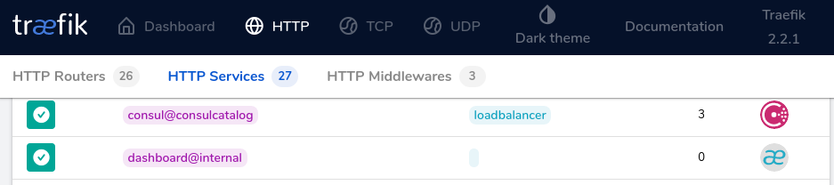

<!-- PROJECT LOGO -->
<br />
<p align="center">
  <a href="https://github.com/github_username/repo">
    
  </a>

  <h3 align="center">This is a repo of my settings and my experiences</h3>

  <p align="center">
    <a href="https://www.consul.io/docs"><strong>Explore the official docs »</strong></a>
    <br />
    <br />
    <a href="https://github.com/hashicorp/consul">Official Github</a>
    ·
    <a href="https://www.hashicorp.com/products/consul">Consul Enterprise</a>
    ·
    <a href="https://github.com/hashicorp/consul/issues">Office Issues</a>
  </p>
</p>

<!-- TABLE OF CONTENTS -->
## Index

* [Prerequisites](#prerequisites)
* [Important notes](#important-notes)
* [Consul Cluster Single Node](#consul-cluster-single-node)
* [Consul Cluster Multi Node](#consul-cluster-multi-node)
* [Consul Cluster Multi Node With acl](#consul-cluster-multi-node-with-acl)
* [Consul Cluster Multi Node With acl using traefik](#consul-cluster-multi-node-with-acl-using-traefik)


# Configuration for the application of Consul 1.7.x On Docker

<p align="center">
    <br />
    <br />
    
    <br />
</p>

Consul is a distributed, highly available, and data center aware solution to connect and configure applications across dynamic, distributed infrastructure.

Consul provides several key features:

* Multi-Datacenter
* Service Mesh/Service Segmentation
* Service Discovery
* Health Checking
* Key/Value Storage

Consul runs on Linux, Mac OS X, FreeBSD, Solaris, and Windows. A commercial version called [Consul Enterprise](https://www.hashicorp.com/products/consul)
is also available.

<!-- PREREQUISITES  -->
### Prerequisites

* [Docker = v.19.03.12 or higher](https://docs.docker.com/engine/install/)
* [Docker-Compose = v.1.25.0-rc4 or higher](https://docs.docker.com/compose/install/)

<!-- IMPORTANT NOTES  -->
### Important notes

There are a few things that we are going to make clear from the beginning, all the settings shown here will have the same pattern so it is better to clarify them at the beginning so that there is no confusion about it.

* All Consul settings are in JSON config Files.
* All examples shown here with using docker.
* A docker compose per Node inside every project was used to deploy all the necessary components for its operation.
* Use the minimum lines in the docker compose ***(I hate docker-compose files with long amounts of lines)***.
* In all the multi node configurations in Master 1 are the files to make their respective backups
    - consul_backup_generator.sh
    - consul_backup_restore.sh
* In order to execute any of the configurations the following this command 
```
docker-compose up -d
```
or if you only want to run a single container
```
docker-compose up -d NAME_OF_SERVICE_TO_DECLARE_THE_CONTAINER
```
* Consul works with tokens created through ***uuid*** you can use the following [link](https://www.uuidgenerator.net/version4) to generate online or use your console, it is to your liking

<!-- CONSUL CLUSTER SINGLE NODE  -->
## Consul Cluster Single Node
This configuration is oriented for development which displays 3 container of consul created a cluster in the same node in this way you can start to develop more quickly and efficiently.

Here is a diagram of how it could be seen:

<p align="center">
    <br />
    <br />
    
    <br />
</p>

### Software version
* Consul = `1.7.3` Official website [Link](https://hub.docker.com/_/consul)

### Consul Configs
 *  In this part we don't have much to specify, little configuration for consul to work correctly using the file consul-config.json.

<!-- CONSUL CLUSTER MULTI NODE  -->
## Consul Cluster Multi Node
In this configuration it can be considered that it is for a more complex environment where we separate each service of the query cluster in an individual node, this can be used as a reference for more complex projects, including agents in other nodes.

Here is a sample of what the diagram looks like:

<p align="center">
    <br />
    <br />
    
    <br />
</p>

### Software version
* Consul = `1.7.3` Official website [Link](https://hub.docker.com/_/consul)
* Registrator = `master` Official website [Link](https://gliderlabs.github.io/registrator/latest/)

### Consul Configs
Here if there are a couple of things that should be explained why the settings change dramatically with respect to the single node.

***Server config***
* In order for a functional cluster to be built, it is necessary to create an individual configuration file for each one.
*Also declare how many servers the cluster expects to configure in our case 3.
* in order for the nodes to be found by the node's IP and not by the container's IP, it is necessary to use the function advertise or advertise_addr that is shown in the official documentation of consul [LINK](https://www.consul.io/docs/agent/options#_advertise).
* We also declare where the information of our node will be stored.
* we move the name of our node to the configuration file.
* it is necessary to know the ips of the equipment where we are going to run our query so that it can create the cluster and in case of losing any node it can retry to build it.

***Agent config***
* As in the server it requires a configuration file with the minimum to function.
* in this configuration we declare that it is not a server and therefore it has the function of false.
* just like the server it is necessary to use the function advertise to publish the IP of the node, not that of the container in the registry in the consul cluster.
* the rest of the information is practically the same.

<!-- CONSUL CLUSTER MULTI NODE WITH ACL  -->
## Consul Cluster Multi Node With acl
It is this configuration that we are going to find different with respect to the previous one is how **access control** is incorporated into the query using its official method [LINK](https://www.consul.io/docs/acl), it is a bit complicated but we are going to try to declare it as clearly as possible, we will not put diagram for which uses the same structure as the previous one, a cluster of 3 with an agent 1, it should be noted that many more agent nodes can be added but for didactic reasons we will leave it that way.


### Software version
* Consul = `1.7.3` Official website [Link](https://hub.docker.com/_/consul)
* Registrator = `master` Official website [Link](https://gliderlabs.github.io/registrator/latest/)

### Consul Configs
The way in which this cluster is created using acl is as follows, you must run the creation script on master 1 then normally run the other 2

Master node 1
```
./docker-compose.sh
```
Master node 2 and 3
```
docker-compose up -d
```
Why it should be done this way because the bash script executes the docker compose command but additionally it also creates ACL rules automatically using the official query command [LINK](https://www.consul.io/docs/commands/acl)
These are the ACLs that you create automatically

- Agent = works so that external consul agents can communicate with the consul cluster without problems
- Registry = serves for the container registry service running on external nodes
- Consul service = It is used to register the own consul service with the new checks of the service
- Anonymous = serves to define the basic policies of the user anonymous

[OFFICIAL DOCUMENTATION FOR ACL LINK](https://www.consul.io/api/acl/policies.html)

* To create the necessary **uuid** please see important notes at the beginning of this manual to know how to generate.
* it is necessary to create the 3 containers at the same time for the cluster to define who is the leader so that the acl can be created, if only node master 1 is executed with the script and the other two masters are not created the acl never leave to create because they need to have a leader in the cluster.
* Another thing is that the script file has a token predefined for each one of the ACLs, if you do not want to use a defined token, consul automatically generates tokens, so if no query is defined, it creates one by default for each ACL.

***Server config***
* for server configuration we add to our configuration file the ACL enablement with its respective token to make it work

***Agent config***
* here in our configuration file we only create the acl with the agent token that we created previously in our cluster

Here we can see some examples of what the consul GUI looks like with the active acl

<p align="center">
    <br />
    <br />
    
    <br />
</p>

<p align="center">
    <br />
    <br />
    
    <br />
</p>

<p align="center">
    <br />
    <br />
    
    <br />
</p>

<p align="center">
    <br />
    <br />
    
    <br />
</p>

<!-- CONSUL CLUSTER MULTI NODE WITH ACL USING TRAEFIK  -->
## Consul Cluster Multi Node With acl using traefik
For this last case, the only difference is that we are going to integrate our query with the traefik service. Here is the link to the repository that you create in case you want to implement [LINK](https://github.com/faritvidal/Config-Traefik-2.2.X)

### Software version
* Consul = `1.7.3` Official website [Link](https://hub.docker.com/_/consul)
* Registrator = `master` Official website [Link](https://gliderlabs.github.io/registrator/latest/)

### Consul Configs
In this part we keep the same configurations of our consul cluster but we add some different details so that our consul works with traefik service.

* As a requirement for the services registered in Consul to be read by Trafik, it is necessary to add tags to the services.

***Server config***
* To the service that registers consul, the necessary labels are added so that if in case of a perfer, this is automatically unregistered from traefik service.

<p align="center">
    <br />
    <br />
    
    <br />
</p>

***Agent config***
* in the docker-compose file leave a commented microservice as a reference of the things needed to register the service with the necessary tags.

These are some examples of how the integrated query to traefik service looks

<p align="center">
    <br />
    <br />
    
    <br />
</p>

<p align="center">
    <br />
    <br />
    
    <br />
</p>